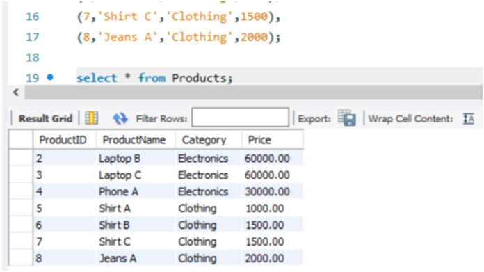
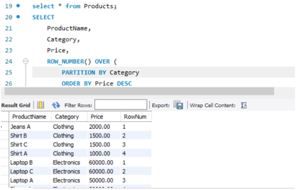
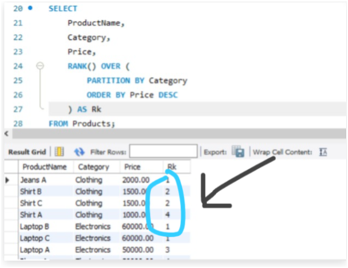
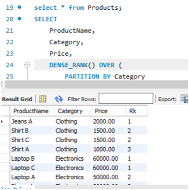
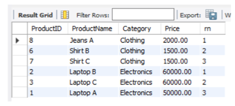
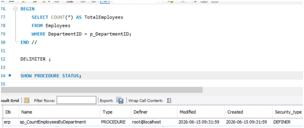
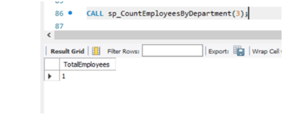

Module 3 - Advanced SQL Using SQL Server
Exercise-1:
 

1. ROW_NUMBER()
Assigns a unique number to every row, even when prices are the same.
 

2. RANK()
Rows with the same value get the same rank, but ranks are skipped when duplicate values came.

 

3. DENSE_RANK()
Rows with the same value get the same rank, but no ranks are skipped.
 

4)  Top 3 Most Expensive Products in Each Category
     By using all three functions we can achive the required condition
WITH RankedProducts AS
(
    SELECT *,
           ROW_NUMBER() OVER (
               PARTITION BY Category
               ORDER BY Price DESC
           ) AS rn
    FROM Products
)
SELECT *
FROM RankedProducts
WHERE rn <= 3;
Output:
 

Exercise 1: Create a Stored Procedure
Stored Procedure :
A Stored Procedure is a collection of SQL statements stored in the database and executed whenever needed.
1. Stored Procedure to Retrieve Employees by Department
- Write the SQL query to select employee details based on the DepartmentID.

Exercise 5: Return Data from a Stored Procedure

To print:
Due to unsupporting of system, unable to use – My SQL Server.So, doing in “MySQL Workbench”

SQL Server	MySQL
EXEC ProcedureName(...)	CALL ProcedureName(...)
CREATE PROCEDURE	CREATE PROCEDURE
EXEC sp_InsertEmployee ...	CALL sp_InsertEmployee(...)
 
CALL sp_CountEmployeesByDepartment(3);

Overview:
Advanced SQL Server topics: window functions (OVER, PARTITION BY, ROW_NUMBER, RANK), CTEs, PIVOT/UNPIVOT, views, indexes, stored procedures, triggers, cursors, and query optimization.

Learning objectives:
- Use window functions and CTEs for advanced queries.
- Design and optimize indexes and views.
- Create and manage stored procedures, functions, triggers.

Hands-on: Follow the module links in the handbook and complete mandatory exercises from the GitHub repository.
