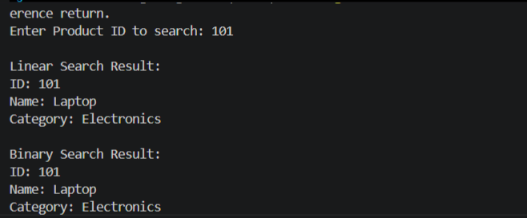

# Exercise 2: E-commerce Platform Search Function

## Objective

The objective of this exercise is to understand and implement searching techniques used in an e-commerce platform. Search operations are fundamental in online shopping applications because customers frequently search for products by their identifiers, names, or categories. Efficient searching improves user experience and system performance.

---

# 1. Understanding Asymptotic Notation

## What is Big O Notation?

Big O Notation is a mathematical representation used to describe the performance or efficiency of an algorithm as the size of the input increases.

It helps developers:

* Measure algorithm efficiency.
* Compare different algorithms.
* Predict performance for large datasets.
* Optimize application response time.

### Common Time Complexities

| Complexity | Name              | Performance |
| ---------- | ----------------- | ----------- |
| O(1)       | Constant Time     | Excellent   |
| O(log n)   | Logarithmic Time  | Very Fast   |
| O(n)       | Linear Time       | Moderate    |
| O(n log n) | Linearithmic Time | Good        |
| O(n²)      | Quadratic Time    | Slow        |
| O(2ⁿ)      | Exponential Time  | Very Slow   |

---

# 2. Search Operation Scenarios

## Best Case

The desired element is found immediately.

### Linear Search

The target is located at the first position.

Complexity:

O(1)

### Binary Search

The target is located exactly at the middle position.

Complexity:

O(1)

---

## Average Case

The target is found somewhere in the middle portion of the dataset.

### Linear Search

Approximately n/2 comparisons.

Complexity:

O(n)

### Binary Search

Approximately log₂(n) comparisons.

Complexity:

O(log n)

---

## Worst Case

The target is either located at the last position or does not exist.

### Linear Search

All elements are examined.

Complexity:

O(n)

### Binary Search

Search space is repeatedly divided in half.

Complexity:

O(log n)

---

# 3. Product Class

The Product class represents items available on the e-commerce platform.

Attributes:

* ProductId
* ProductName
* Category

Example:

| Product ID | Product Name | Category    |
| ---------- | ------------ | ----------- |
| 101        | Laptop       | Electronics |
| 102        | Mobile       | Electronics |
| 103        | Shoes        | Fashion     |

---

# 4. Linear Search

## Definition

Linear Search sequentially checks every element until the desired item is found.

### Algorithm

1. Start from the first element.
2. Compare the target with the current element.
3. If matched, return the element.
4. Otherwise move to the next element.
5. Continue until found or end of array is reached.

### Time Complexity

| Case    | Complexity |
| ------- | ---------- |
| Best    | O(1)       |
| Average | O(n)       |
| Worst   | O(n)       |

### Advantages

* Simple to implement.
* Works on unsorted data.
* No preprocessing required.

### Disadvantages

* Slow for large datasets.
* Requires checking many elements.

---

# 5. Binary Search

## Definition

Binary Search repeatedly divides a sorted dataset into halves until the target is found.

### Prerequisite

The array must be sorted.

### Algorithm

1. Find the middle element.
2. Compare with target.
3. If equal, return result.
4. If target is smaller, search left half.
5. If target is larger, search right half.
6. Repeat until found or search space becomes empty.

### Time Complexity

| Case    | Complexity |
| ------- | ---------- |
| Best    | O(1)       |
| Average | O(log n)   |
| Worst   | O(log n)   |

### Advantages

* Extremely fast for large datasets.
* Requires fewer comparisons.

### Disadvantages

* Data must be sorted.
* Additional maintenance required when inserting records.

---

# 6. Comparison of Linear Search and Binary Search

| Feature                  | Linear Search | Binary Search |
| ------------------------ | ------------- | ------------- |
| Data Requirement         | Unsorted      | Sorted        |
| Best Case                | O(1)          | O(1)          |
| Average Case             | O(n)          | O(log n)      |
| Worst Case               | O(n)          | O(log n)      |
| Implementation           | Simple        | Moderate      |
| Efficiency on Large Data | Low           | High          |

---

# 7. Suitability for E-Commerce Platform

For a modern e-commerce platform containing thousands or millions of products, Binary Search is more suitable because it significantly reduces the number of comparisons required to locate a product.

Example:

For 1,000,000 products:

Linear Search:

* Up to 1,000,000 comparisons.

Binary Search:

* Approximately 20 comparisons.

Therefore, Binary Search provides better scalability, faster response times, and improved customer experience.

However, Binary Search requires products to be maintained in sorted order. For smaller or unsorted datasets, Linear Search remains a practical solution.

---

# Conclusion

This exercise demonstrated the implementation and analysis of Linear Search and Binary Search algorithms. While Linear Search is simple and effective for small datasets, Binary Search offers superior performance for large-scale e-commerce applications due to its logarithmic time complexity. Understanding algorithm efficiency using Big O Notation helps developers select the most appropriate solution for real-world systems.
## SCreenshots
