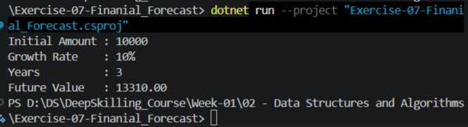

# Exercise 7: Financial Forecasting

## Objective

The objective of this exercise is to understand recursion and apply it to financial forecasting. Financial forecasting helps organizations estimate future values such as revenue, investments, savings, or stock prices based on historical growth rates.

---
# Screenshot

# 1. Understanding Recursive Algorithms

## What is Recursion?

Recursion is a programming technique in which a method calls itself to solve a smaller version of the same problem.

A recursive solution consists of:

### Base Case

A condition that stops further recursive calls.

### Recursive Case

The part where the method calls itself with a smaller input.

---

## Example

Factorial Calculation

n! = n × (n-1)!

Example:

5! = 5 × 4 × 3 × 2 × 1

Recursive definition:

factorial(n) = n × factorial(n-1)

Base case:

factorial(1) = 1

---

## Advantages of Recursion

* Simplifies complex problems.
* Produces cleaner and shorter code.
* Naturally fits divide-and-conquer algorithms.
* Useful for tree and graph traversals.

---

## Disadvantages of Recursion

* Additional memory usage due to function call stack.
* Can cause stack overflow for large inputs.
* May perform redundant calculations if not optimized.

---

# 2. Financial Forecasting Problem

Suppose an investment grows by a fixed percentage every year.

Example:

Initial Value = ₹10,000

Growth Rate = 10%

Years = 3

Calculation:

Year 1:

10000 × 1.10 = 11000

Year 2:

11000 × 1.10 = 12100

Year 3:

12100 × 1.10 = 13310

Future Value = ₹13,310

---

# 3. Recursive Approach

Let:

FV(n) = Future value after n years

Formula:

FV(n) = FV(n-1) × (1 + growthRate)

Base Case:

FV(0) = Initial Value

Recursive Case:

FV(n) = FV(n-1) × (1 + growthRate)

---

# 4. Algorithm

1. Accept initial investment amount.
2. Accept annual growth rate.
3. Accept number of years.
4. If years = 0, return current value.
5. Otherwise:

   * Calculate next year's value.
   * Recursively forecast remaining years.
6. Return final predicted value.

---

# 5. Time Complexity Analysis

## Recursive Solution

For each year, exactly one recursive call is made.

Example:

Forecast(3)

→ Forecast(2)

→ Forecast(1)

→ Forecast(0)

Number of calls = n

Time Complexity:

O(n)

Space Complexity:

O(n)

because each recursive call occupies stack memory.

---

# 6. Optimization Techniques

## Tail Recursion

Pass the current forecast value as a parameter.

Benefits:

* Reduces intermediate calculations.
* More efficient recursive structure.

---

## Iterative Approach

Instead of recursion:

for each year:

value = value × (1 + growthRate)

Time Complexity:

O(n)

Space Complexity:

O(1)

This eliminates recursive stack overhead.

---

## Memoization

Store previously calculated results.

Useful when recursive calls repeat calculations.

Time Complexity:

Can improve significantly in overlapping-subproblem scenarios.

---

# 7. Practical Applications

Financial forecasting is widely used for:

* Investment planning
* Retirement savings estimation
* Revenue forecasting
* Stock market projections
* Business growth prediction

---

# Conclusion

This exercise demonstrated the use of recursion in financial forecasting. The recursive algorithm repeatedly calculates future values based on annual growth rates until the desired forecast period is reached. While recursion provides a clean and intuitive solution, it consumes additional stack memory. For large forecasting periods, iterative solutions or optimized recursive techniques are generally preferred.
