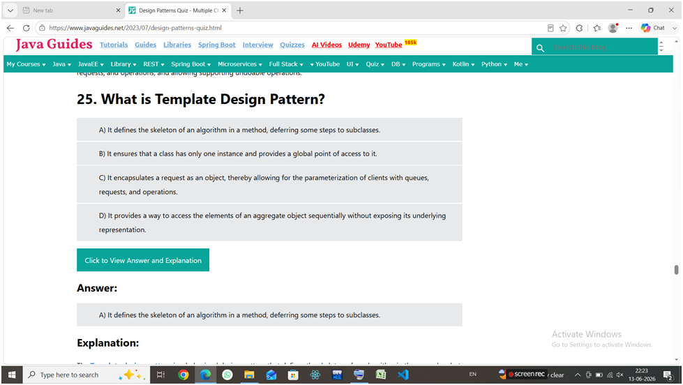

# Module 1 - Design Patterns and Principles

## Overview
This module introduced the SOLID Design Principles and common Design Patterns used to build clean, maintainable, scalable, and reusable software systems.

## SOLID Principles

The SOLID principles were introduced by **Robert C. Martin (Uncle Bob)**.

### S - Single Responsibility Principle (SRP)
A class should have only one responsibility and one reason to change.

**Example:**  
- `Book` → Stores book data  
- `BookPrinter` → Prints book data

**Memory Trick:** One Class = One Job

### O - Open/Closed Principle (OCP)
A class should be open for extension but closed for modification.

**Example:**  
- `Guitar`
- `FlameGuitar extends Guitar`

**Memory Trick:** Extend, Don't Modify

### L - Liskov Substitution Principle (LSP)
A subclass should be able to replace its parent class without affecting program behavior.

**Memory Trick:** Child Should Behave Like Parent

### I - Interface Segregation Principle (ISP)
Clients should not be forced to implement methods they do not use.

**Example:**  
Instead of one large interface, use smaller focused interfaces such as:
- `BearCleaner`
- `BearFeeder`
- `BearPetter`

**Memory Trick:** Small Interfaces are Better

### D - Dependency Inversion Principle (DIP)
Depend on abstractions rather than concrete implementations.

**Example:**  
`Windows98Machine` depends on `Keyboard` (interface), not `StandardKeyboard`.

**Memory Trick:** Depend on Interface, Not Implementation

## SOLID in One Line

| Principle | Summary |
|------------|---------|
| SRP | One Class = One Responsibility |
| OCP | Extend, Don't Modify |
| LSP | Child Should Replace Parent Safely |
| ISP | Small Focused Interfaces |
| DIP | Depend on Abstractions |

## Design Patterns

A design pattern is a reusable solution to a common software design problem.

### Categories of Design Patterns
- **Creational Patterns** – Object creation mechanisms.
- **Structural Patterns** – Class and object composition.
- **Behavioral Patterns** – Communication between objects.

## Key Learnings
- Applied SOLID principles for better software design.
- Understood the purpose of Creational, Structural, and Behavioral patterns.
- Learned how design patterns improve code reusability, maintainability, and scalability.

### Quiz Participation
